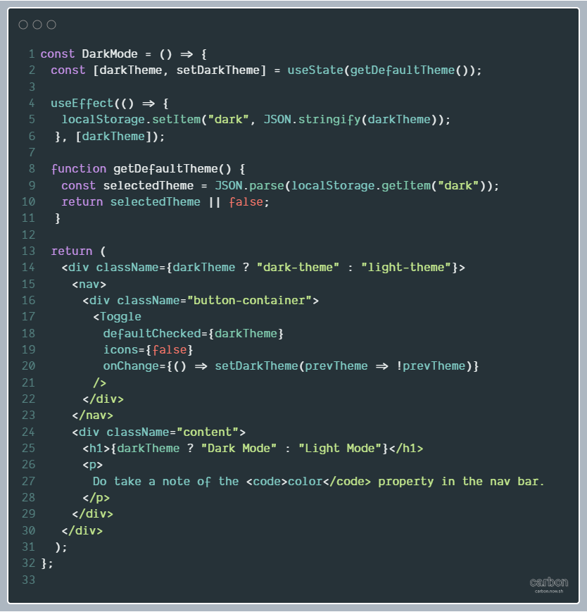

# React Parcel with Dark Mode in React Hooks
### Language(s): React JS

This repository is a experiment implementing Dark Mode using React Hooks.

Hosted @ [dark-mode-react.netlify.com](https://dark-mode-react.netlify.com)

Code Snippet: 

## Important Features:
* Parcel Bundler
* Babel to use latest ES6 functions
* [React Fragments](https://reactjs.org/docs/fragments.html)
* React useState and useEffect Hooks
  
## How to Use
1. Fork this repository
2. Clone to your local machine
3. `npm install` in your terminal to install node-modules
4. `npm start` to open development in your browser
